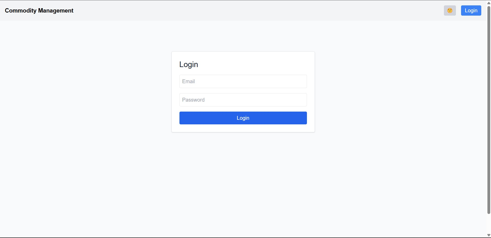
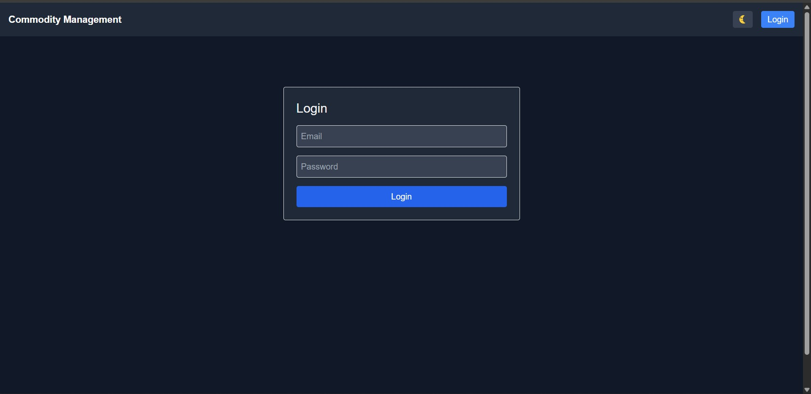
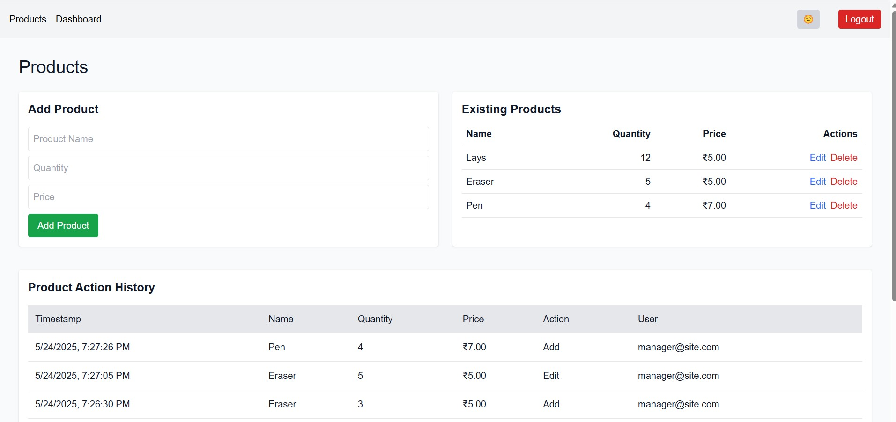
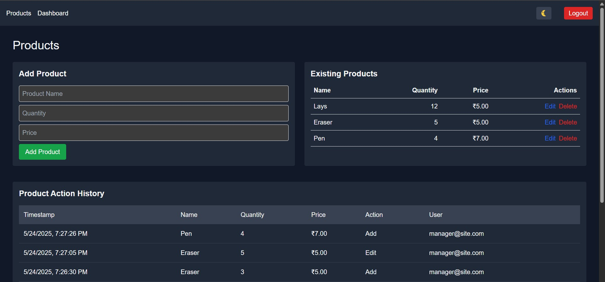
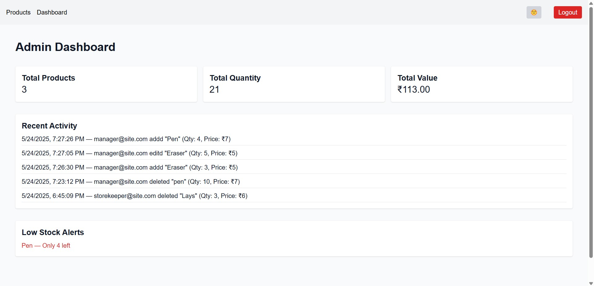
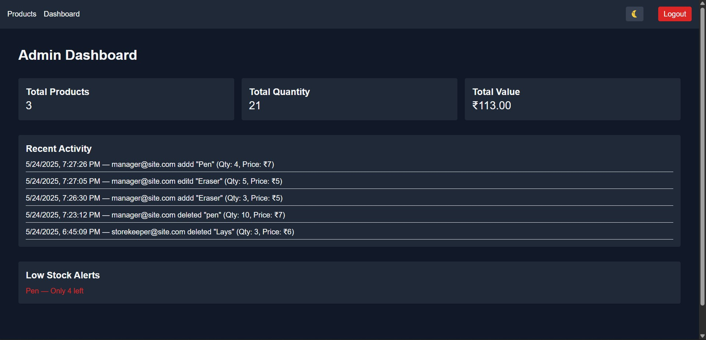

# Commodity Management System

A basic commodity management system developed as a part of the **Slooze Take Home Challenge** for the Frontend Role.

## 🔧 Features

- ✅ Role-based access: **Manager** and **Storekeeper**
- 🌗 Light/Dark Mode Toggle
- 🛒 Add, Edit, and Delete Products
- 📊 Admin Dashboard
- 🔐 Secure Login System

## 🚀 Setup Instructions

1. **Clone the repository**:
   ```bash
   git clone https://github.com/yourusername/commodity-management-system.git
   cd commodity-management-system
   ```

2. **Install dependencies**:
   ```bash
   npm install
   ```

3. **Seed the database with default users**:
   ```bash
   node seed.js
   ```

4. **Start the development server**:
   ```bash
   npm run dev
   ```

Visit [http://localhost:3000](http://localhost:3000) to view the app.

## 🔑 Login Details

### Manager
- **Email:** manager@site.com
- **Password:** password

### Storekeeper
- **Email:** storekeeper@store.com
- **Password:** password

## 🖼️ Screenshots

### Login Page (Light vs Dark)



### Product Page (Light vs Dark)



### Dashboard (Light vs Dark)



## 📁 Technologies Used

- [Next.js](https://nextjs.org/)
- [Tailwind CSS](https://tailwindcss.com/)
- [SQLite](https://www.sqlite.org/index.html)
- [Node.js](https://nodejs.org/)

## 👤 Author

Created by **[@psyamsundar](https://github.com/psyamsundar)**

---

Feel free to suggest improvements!